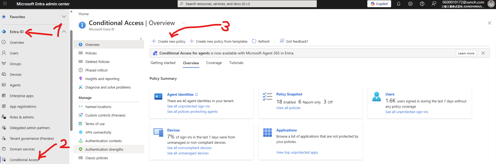
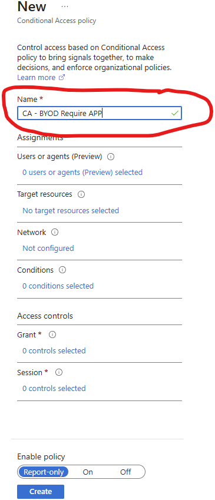
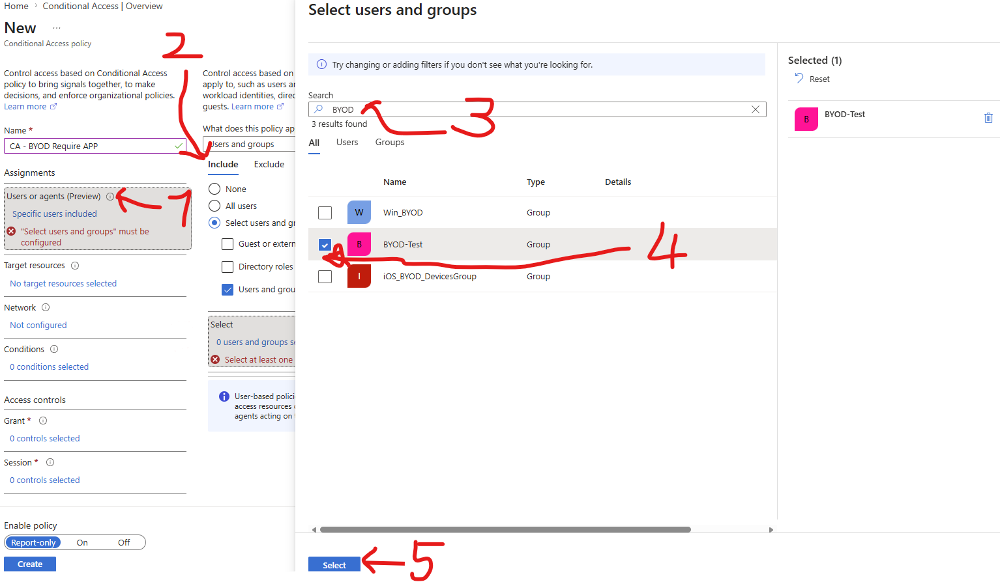
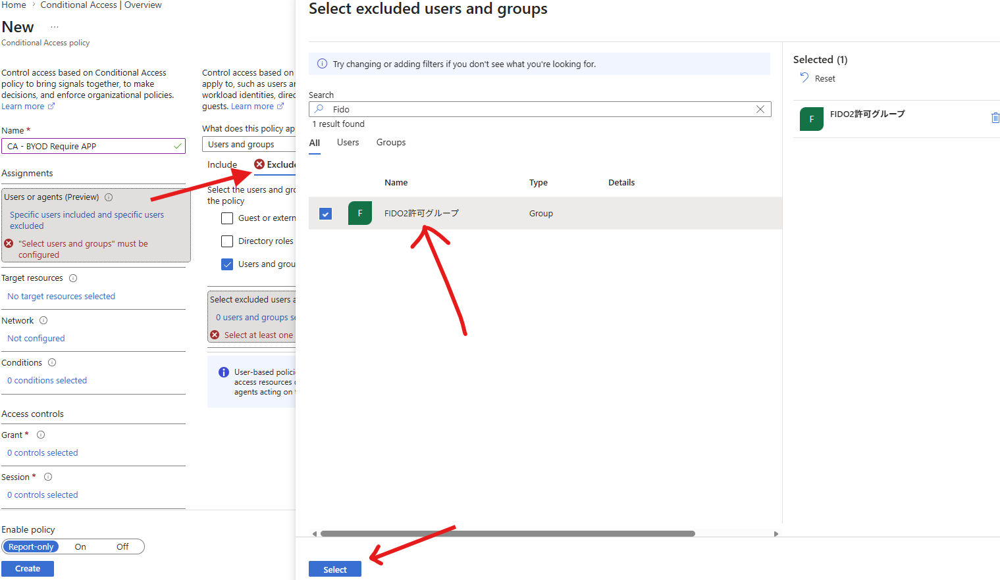
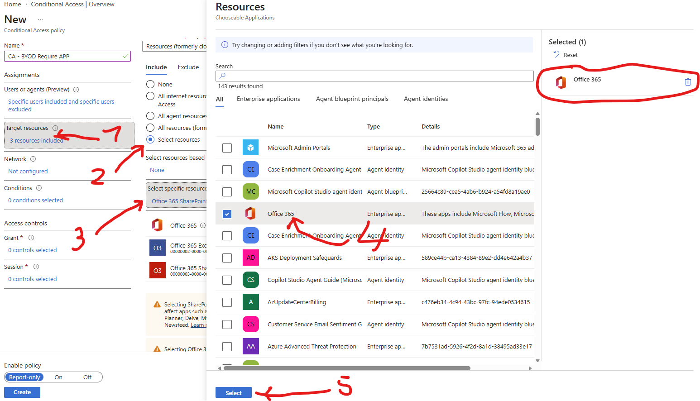
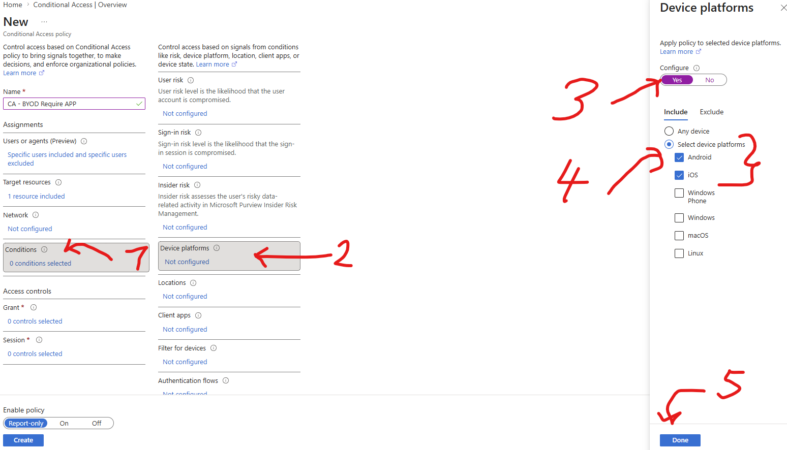
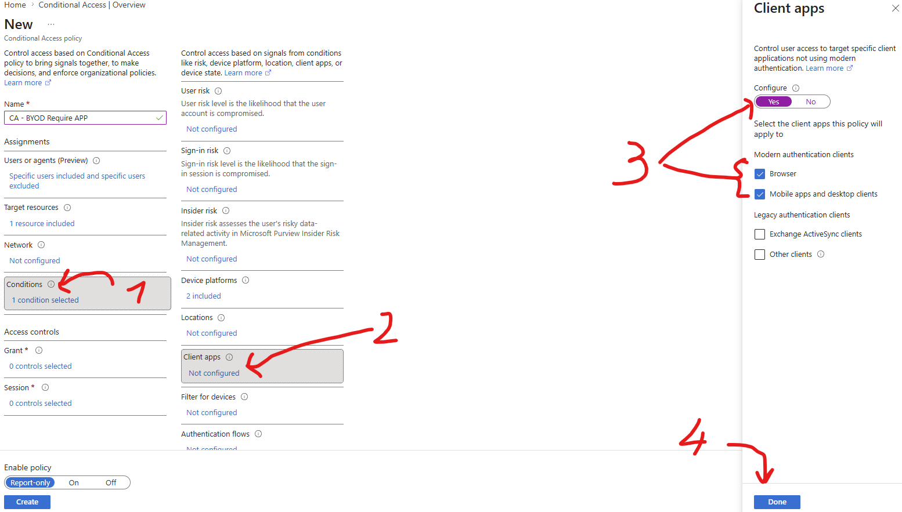
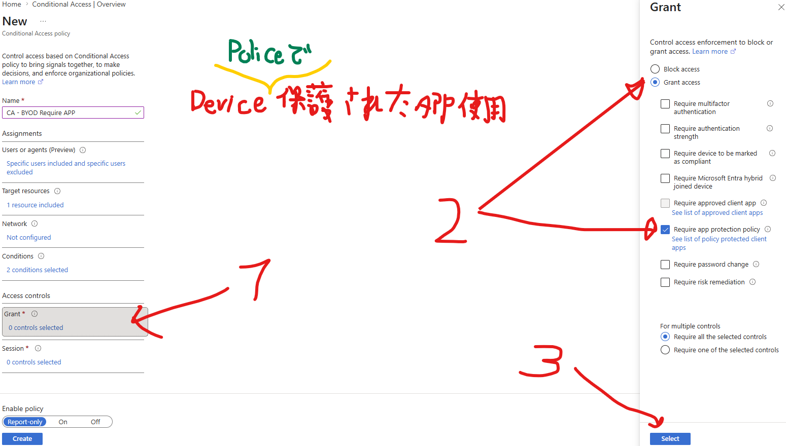
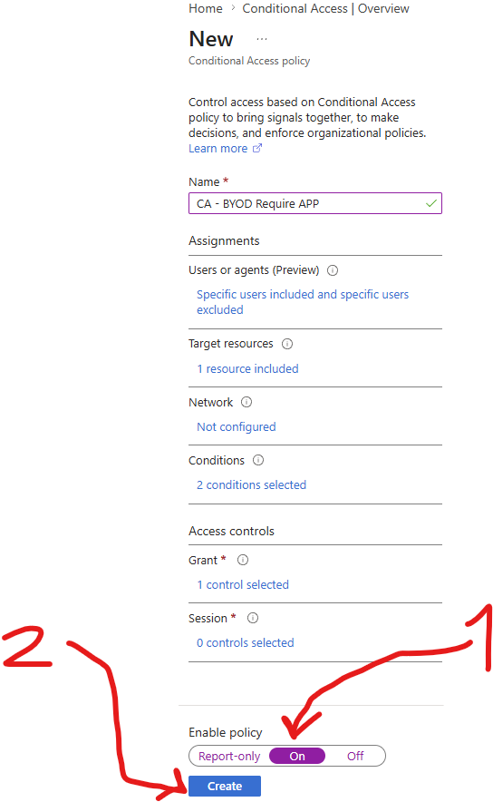

# 🔐 Conditional Access (CA) — BYOD Read-Only Enforcement Guide

このガイドでは、**個人所有モバイル端末**に対して **App Protection Policy（APP）**を強制するための **Conditional Access Policy（CAP）**作成手順

---

# 🧭 WHY Conditional Access is REQUIRED

✅ **Purpose**
- APP が適用された**保護アプリのみ**、Microsoft 365 データへアクセス可能

---

✅ **Without Conditional Access**

- ❌ Users can access:
  - Outlook / OWA via browser (full download)
  - Unmanaged apps
- ❌ Data can be:
  - Downloaded
  - Copied
  - Saved locally
- ❌ APP alone is **NOT enforced**

---

✅ **With Conditional Access**

- ✅ Only APP-protected apps allowed
- ✅ Browser becomes controlled (paired with SharePoint settings)
- ✅ Data leakage prevented

---

# 🧭 STEP — Create Conditional Access Policy

---

## 🔹 1. Navigate

1. Go to **Microsoft Entra admin center**
2. Click **Protection**
3. Click **Conditional Access**
4. Click **New policy**

---

## 🔹 2. Name

5. Name →  
   `CA - BYOD Require APP`

---

## 🔹 3. Assignments — Users

6. Click **Users**
7. Include → **Select users and groups**
8. Select → `BYOD-Test`
9. Exclude → **Break-glass admin accounts**

---

## 🔹 4. Assignments — Cloud Apps

10. Click **Cloud apps**
11. Select → **Office 365**

---

## 🔹 5. Conditions — Device Platforms

12. Click **Conditions**
13. Click **Device platforms**
14. Configure:
   - iOS → ✅
   - Android → ✅

---

## 🔹 6. Conditions — Client Apps

15. Click **Client apps**
16. Select:
   - ✅ Mobile apps and desktop clients
   - ✅ Browser

---

## 🔹 7. Grant Controls

17. Click **Grant**
18. Select:
   - ✅ Require app protection policy

---

## 🔹 8. Enable Policy

19. Enable policy → **On**
20. Click **Create**

---

# ✅ RESULT

- ✅ 保護されたアプリのみデータアクセス可能
- ❌ 管理対象外アプリはブロック
- ❌ ブラウザ経由・直接ダウンロードは禁止（SharePoint設定含む）
- ✅ APPポリシー完全適用に必要

---
