# 📱 BYOD Mobile Read-Only Protection (Intune APP) — Setup Guide

本ガイドは、**個人モバイル端末で閲覧専用アクセス**を設定するための手順

---

# 🧭 STEP 0 — Create Test Group

<table>
<tr>
<td valign="top" style="padding-right: 30px;">
   
1. Go to **Entra admin center**
2. Click **Groups**
3. Click **New group**
4. Group type → **Security**
5. Name → `BYOD-Test`
6. Add → **Test user**
7. Click **Create**

</td>

<td valign="top">

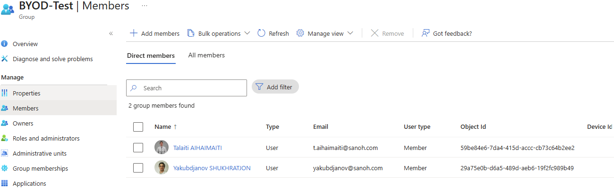  

</td>
</tr>
</table>

---

# 🧭 — Create App Protection Policy

### 🔹 STEP 1. Basics
1. Go to **Intune admin center**
2. Click **Apps**
3. Click **Protection**
4. Click **+ Create**
5. Select platform (iOS / Android)
6. Name → `APP - BYOD ReadOnly`
7. Click **Next**

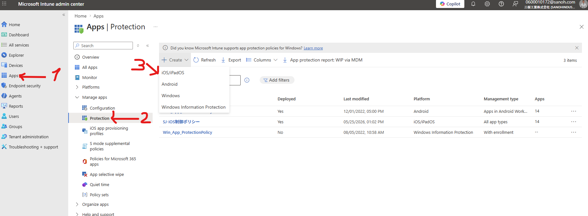
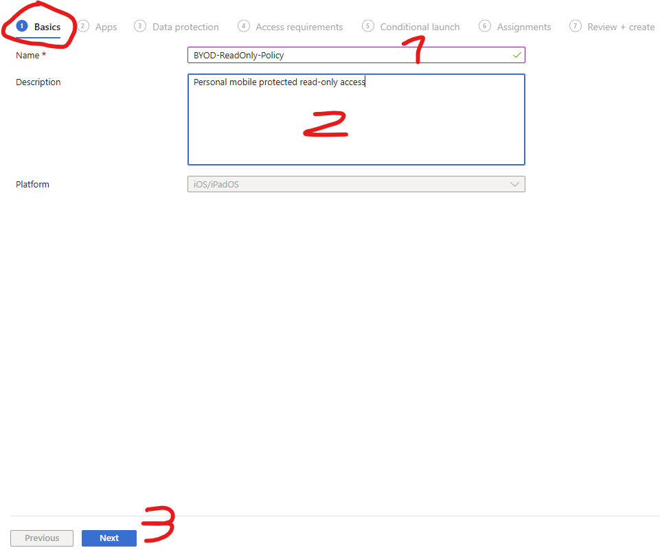

---

### 🔹 STEP 2. Apps
8. Click **Select apps**
9. Add:
   - Outlook
   - Teams
   - OneDrive
   - SharePoint
   - Office
   - (Optional) Edge
10. Click **Next**

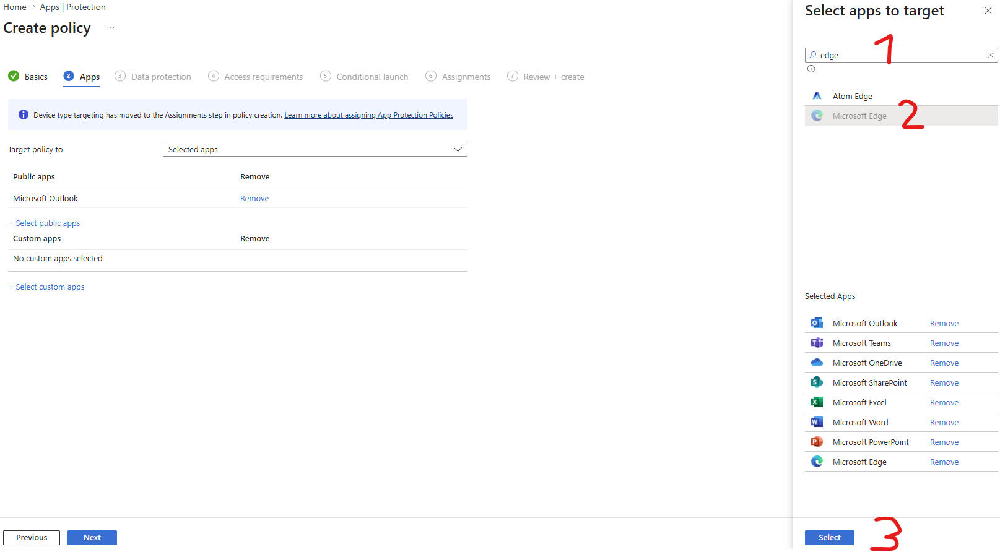
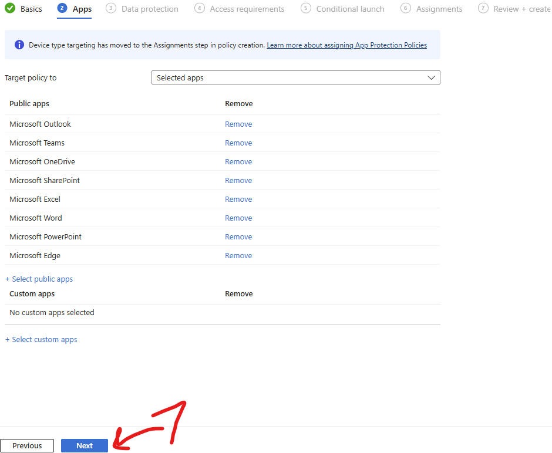

---

### 🔹 STEP 3. Data Protection (READ-ONLY)

11. Backup org data → **Block**  
12. Send org data → **Policy managed apps**  
13. Save copies → **Block**  
14. Allow save to services → **None**  
15. Receive data → **Policy managed apps**  
16. Open data into org → **Allow**  
17. Restrict copy/paste → **Blocked**  
18. Cut/copy limit → **0**  
19. Third-party keyboard → **Block**  

#### Encryption
20. Encrypt org data → **Require**

#### Functionality
21. Sync → **Block**  
22. Printing → **Block**  
23. Web transfer → **Policy managed apps**  
24. Notifications → **Block**  
25. Screen capture → **Block**  
26. Click **Next**

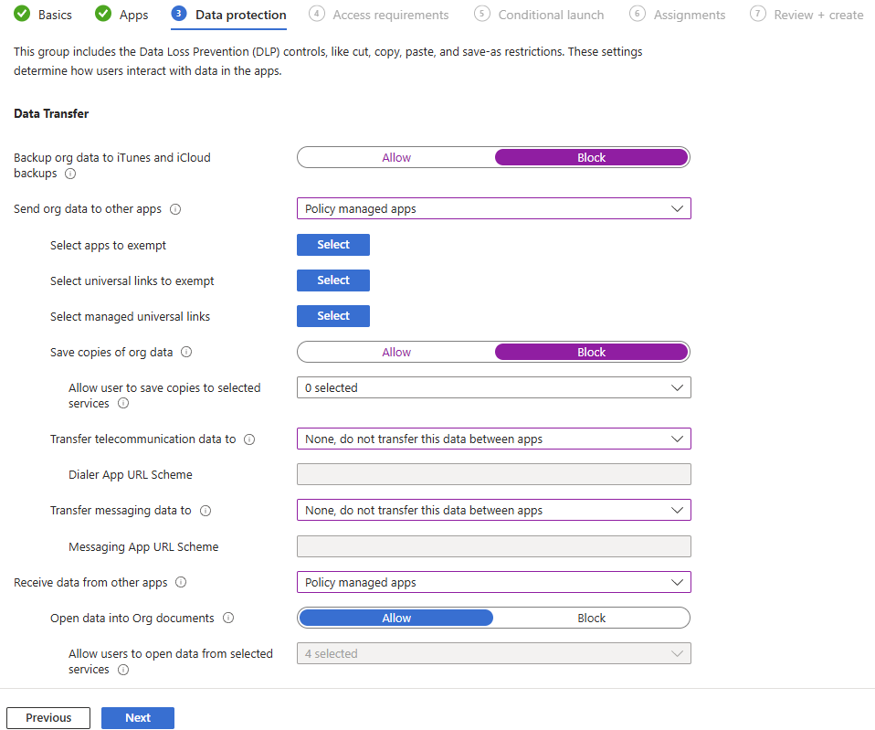
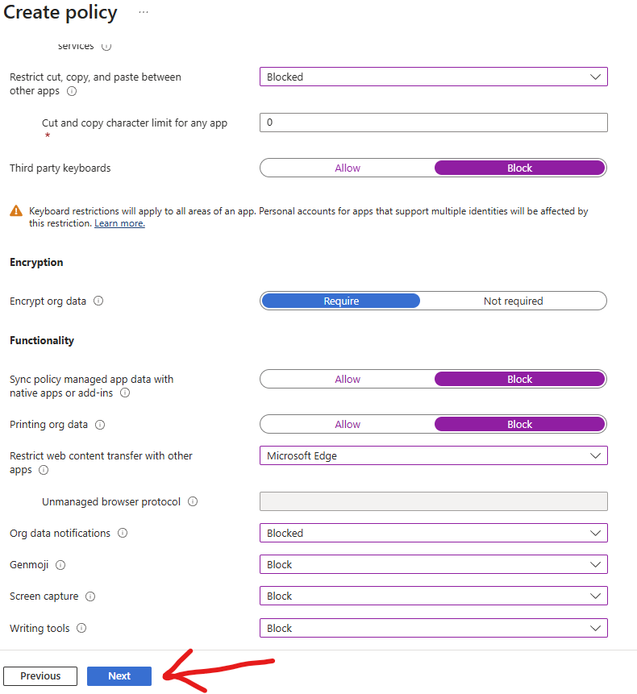

---

### 🔹 STEP 4. Access Requirements

27. PIN → **Require**  
28. PIN type → **Numeric**  
29. Simple PIN → **Block**  
30. Minimum length → **6**  
31. Biometrics → **Allow**  
32. Override with PIN → **Require**  
33. Timeout → **5–15 minutes**  
34. App PIN when device PIN set → **Require**  
35. Work account → **Require**  
36. Click **Next**

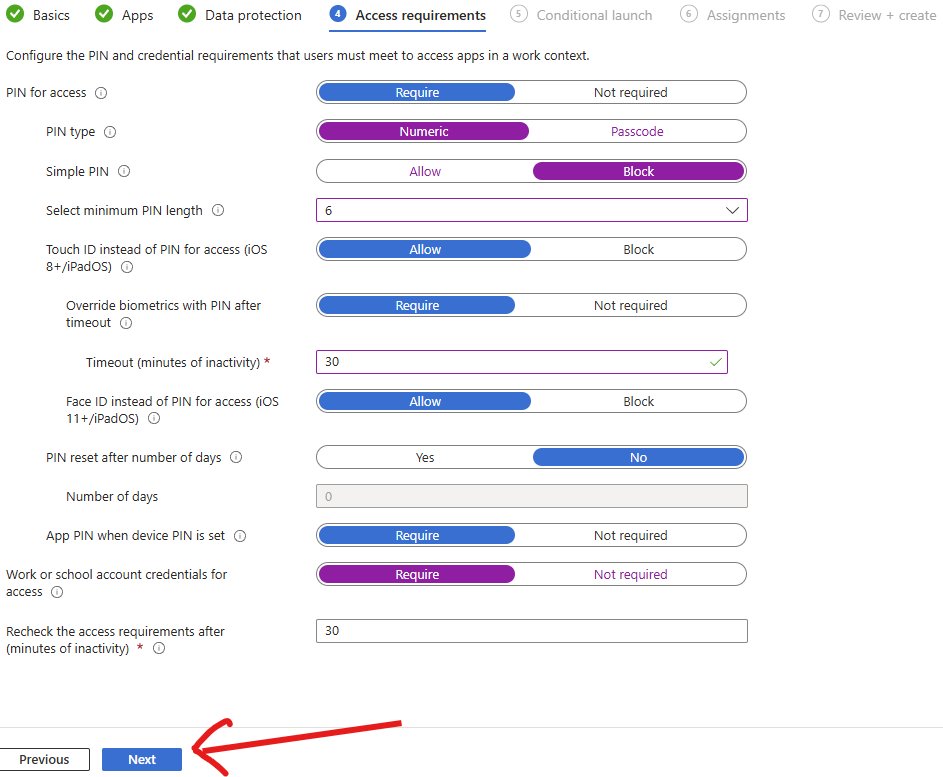

---

### 🔹 STEP 5. Conditional Launch

37. Max PIN attempts → **5 → Reset PIN**  
38. Offline (minutes) → **1440 → Block access**  
39. Offline (days) → **90 → Wipe data**  
40. Jailbroken/rooted → **Block access**  
41. Min OS:
   - iOS → **14.0**
   - Android → **10.0**
42. Action → **Block access**  
43. Click **Next**

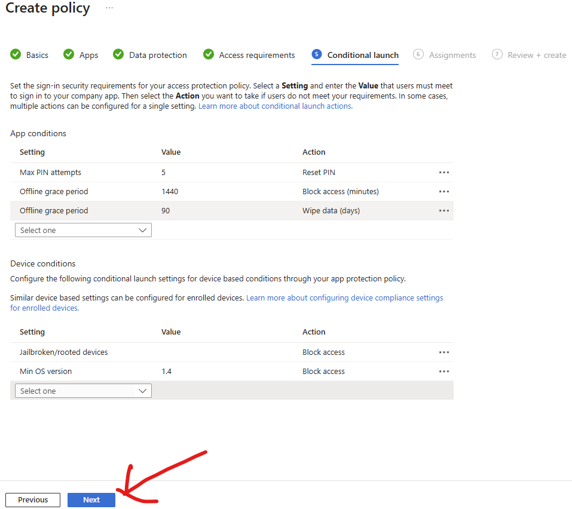

---

### 🔹 STEP 6. Assignments

44. Click **Add groups (Included)**
45. Select → `BYOD-Test`

46. Click **Add groups (Excluded)**
47. Select:
   - Break-glass admin accounts

48. Click **Next**

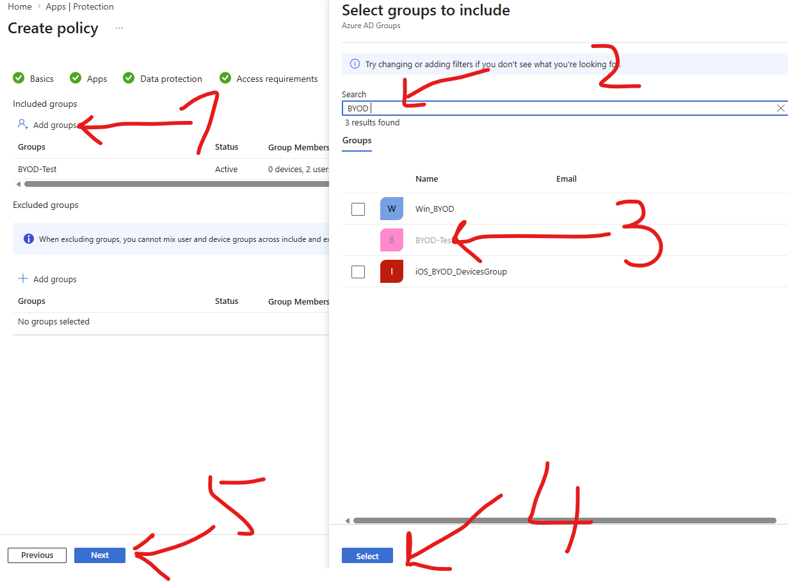

---

### 🔹 STEP 7. Create

49. Click **Create**

<table>
<tr>

<td valign="top">
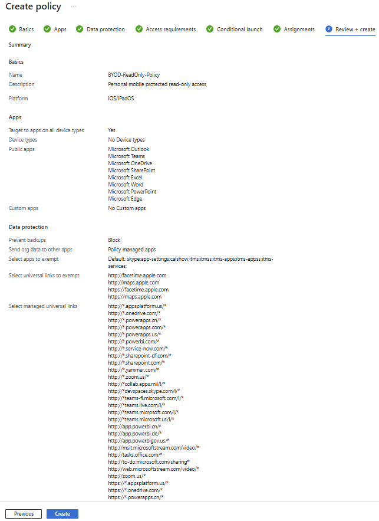  
</td>

<td width="50"></td>

<td valign="top">
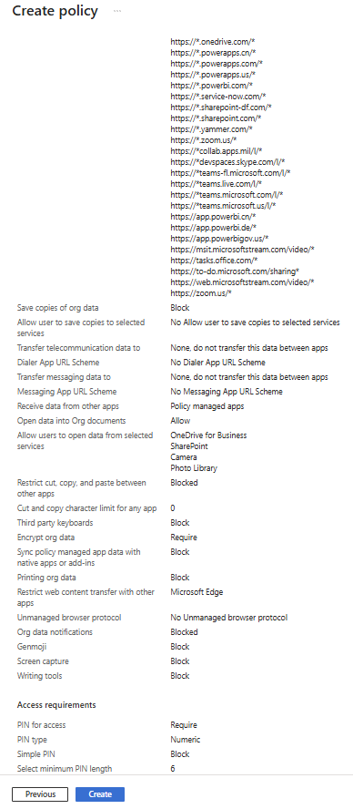  
</td>

</tr>
</table>

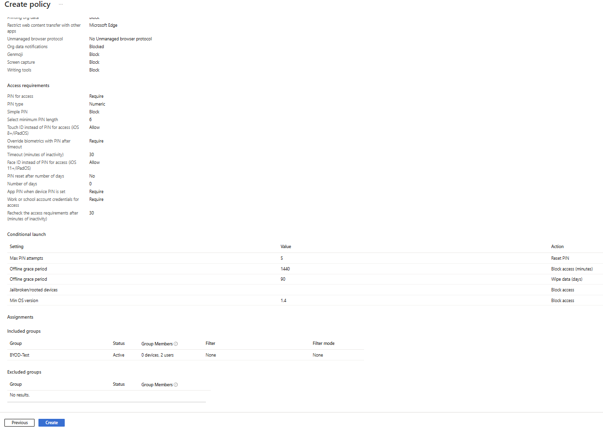

---

# ✅ 目的

- ✅ モバイルアプリは閲覧専用 = **Read-only**
- ❌ No コピー / ペースト / 保存 / ダウンロード / 印刷
- ✅ アプリ単位で会社データを管理・保護 → 端末全体は管理しません。
- ✅ 個人アプリ、写真、個人データは会社から視認不可 → 会社側で操作・管理しません。
- ✅ 端末紛失、盗難、退職時は、会社データのみ削除 → 個人データには影響しません。

---
