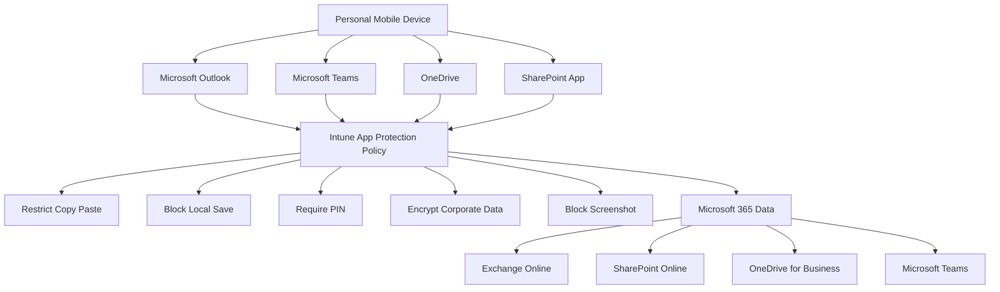
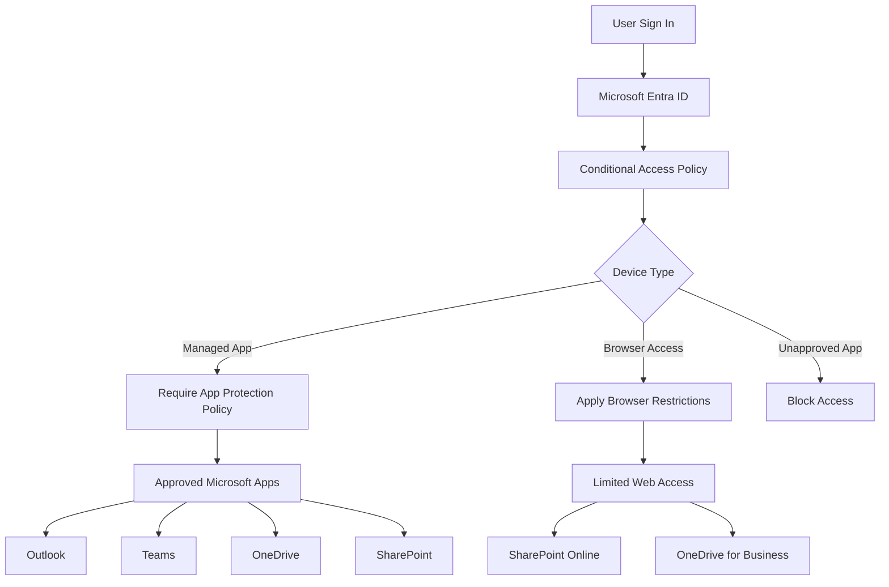
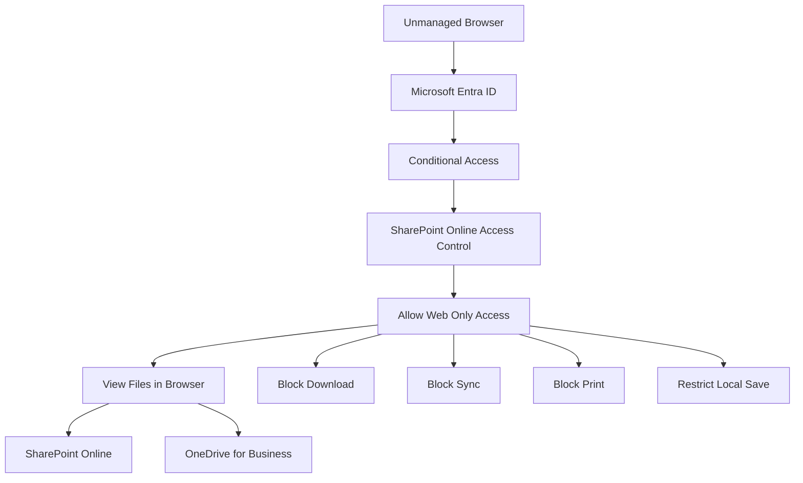
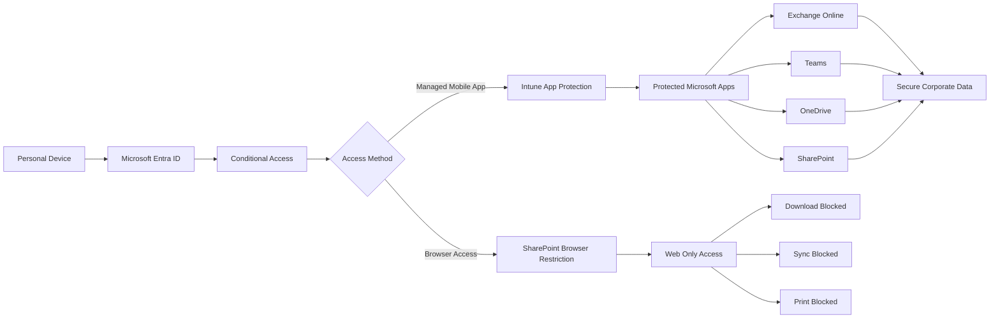
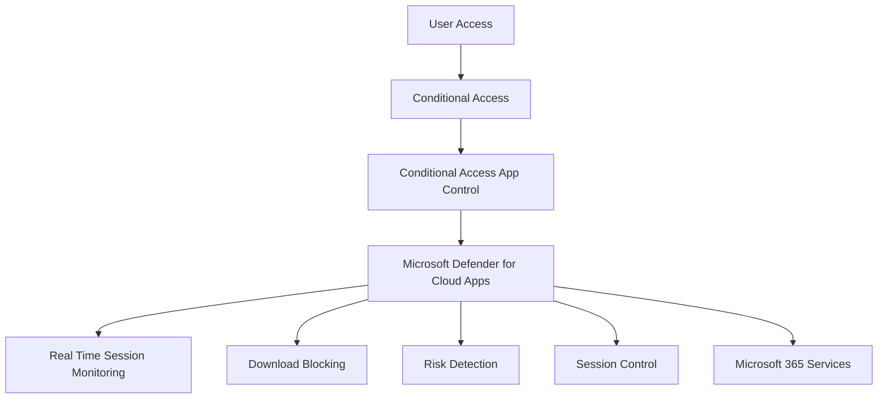
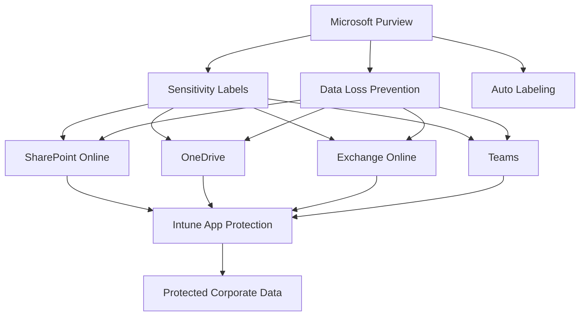
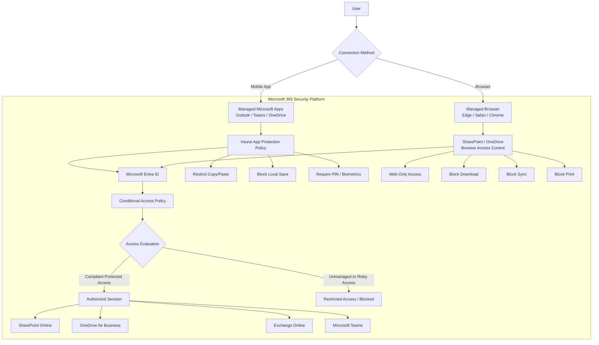

# BYOD Mobile Read-Only Access — Workload Summary

| Workload | Required Role | What should be configured | Why it is essential |
|---|---|---|---|
| Intune App Protection Policies | Intune Administrator | Create iOS/Android App Protection Policies for Outlook, Teams, OneDrive, SharePoint, Office apps, and Edge. Configure data protection, copy/paste restrictions, save-as blocking, encryption, PIN, jailbreak/root detection, and conditional launch. | Protects corporate data inside managed apps without requiring full device enrollment. App protection policies control how corporate data is accessed, shared, copied, saved, or moved between apps. |
| Microsoft Entra Conditional Access | Conditional Access Administrator / Security Administrator | Create CA policy for iOS/Android BYOD users. Target Microsoft 365 apps. Require App Protection Policy. Start in Report-only, then enable. | Ensures users can only access corporate data from apps protected by Intune MAM. Microsoft recommends using “Require app protection policy” for mobile access. |
| SharePoint / OneDrive Access Control | SharePoint Administrator / Global Administrator | Configure unmanaged devices to use “Allow limited, web-only access.” Block download, sync, and opening files in desktop apps from unmanaged devices. | Provides read-only browser access for unmanaged/personal devices and prevents local file download or sync. |
| Microsoft Edge Managed Browser | Intune Administrator | Force web links and corporate web content to open in Microsoft Edge as the managed browser. | Keeps browser sessions inside the protected app ecosystem and prevents data leakage through unmanaged browsers. |
| Defender for Cloud Apps | Security Administrator | Optional future phase: enable Conditional Access App Control and session policies such as block download, monitor risky activity, watermark, and real-time access control. | Adds real-time session protection beyond basic CA and SharePoint controls. Useful for higher-risk users or sensitive workloads. |
| Microsoft Purview | Compliance Administrator | Optional future phase: configure sensitivity labels, DLP, auto-labeling, and endpoint DLP. | Protects sensitive content based on classification, not only device/app state. Essential for long-term compliance and data governance. |

Sources: Microsoft Intune App Protection Policies protect organizational data inside managed apps; Conditional Access can require app protection policy for iOS/Android; SharePoint can limit unmanaged devices to web-only access.  

# Recommended Architecture Notes

| Layer | Control | Result |
|---|---|---|
| Identity Layer | Conditional Access | Decides whether access is allowed based on user, device platform, app, and grant controls. |
| App Layer | Intune App Protection Policy | Protects corporate data inside mobile apps without requiring device enrollment. |
| Browser Layer | SharePoint / OneDrive unmanaged device control | Allows browser viewing but blocks download, sync, and desktop app access. |
| Session Layer | Defender for Cloud Apps | Optional future control for real-time monitoring and session restrictions. |
| Data Layer | Microsoft Purview | Optional future control for sensitivity labels, DLP, encryption, and compliance. |

# Target End-State

| User Action | Expected Result |
|---|---|
| Read email in Outlook mobile | Allowed |
| Open Teams mobile | Allowed |
| View SharePoint / OneDrive file in app | Allowed with MAM controls |
| Copy corporate data to personal app | Blocked |
| Save file locally | Blocked |
| Open file in unmanaged app | Blocked |
| Access SharePoint from browser | Limited web-only access |
| Download from browser | Blocked |
| Sync OneDrive from BYOD | Blocked |

# Intune App Protection Policy Architecture

# Conditional Access Policy Architecture

# SharePoint and OneDrive Browser Control Architecture

# End-to-End Mobile Protection Flow

# Future Architecture with Defender for Cloud Apps

# Future Architecture with Microsoft Purview

# 3. Architecture Overview

